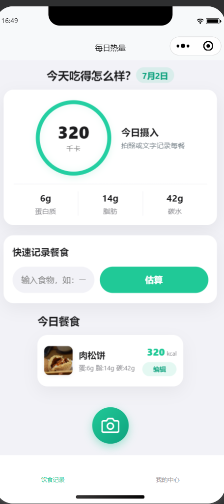
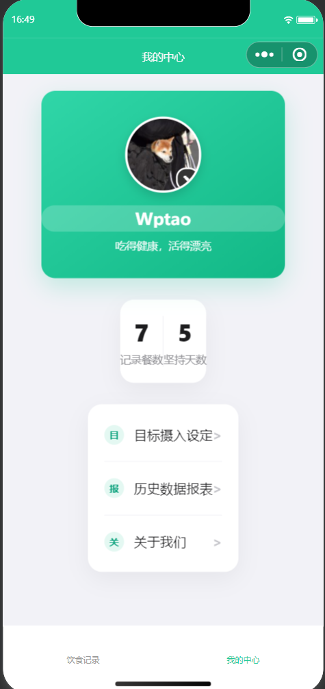

# Log Calories

每日热量记录微信小程序，用于快速记录餐食、估算热量和查看个人饮食统计。项目包含小程序前端页面和云函数目录，可在微信开发者工具中直接打开。

## 界面预览

| 饮食记录 | 我的中心 |
| --- | --- |
|  |  |

## 功能概览

- 今日摄入概览：展示当天热量、蛋白质、脂肪、碳水摄入情况。
- 快速记录餐食：支持输入食物名称并估算营养数据。
- 拍照入口：预留拍照记录餐食的交互入口。
- 今日餐食列表：展示已记录餐食、热量和三大营养素。
- 我的中心：展示用户信息、记录餐数、坚持天数和功能入口。
- 目标与历史：包含目标摄入设置、历史数据报表、关于我们等页面入口。

## 项目结构

```text
.
├── cloudfunctions/          # 云函数
│   ├── cloudbase_auth/
│   └── quickstartFunctions/
├── docs/
│   └── screenshots/         # README 界面截图
├── miniprogram/             # 小程序源码
│   ├── components/
│   ├── images/
│   └── pages/
├── project.config.json      # 微信开发者工具项目配置
└── uploadCloudFunction.sh   # 云函数上传脚本
```

## 本地运行

1. 使用微信开发者工具打开本项目目录。
2. 确认 `project.config.json` 中的小程序 AppID 与你的开发账号匹配。
3. 如需使用云函数，在微信开发者工具中选择对应云环境并上传 `cloudfunctions/` 下的函数。
4. 云函数依赖不随仓库提交，可在对应函数目录执行 `npm install` 安装。

## Git 提交说明

仓库已忽略本地配置和依赖目录，包括：

- `node_modules/`
- `miniprogram_npm/`
- `project.private.config.json`
- `.agents/`
- `.codex/`

`project.config.json` 中的 `appid` 是微信小程序公开标识，不是密钥。真正的 Secret、Token、私钥、云开发密钥等不应写入代码仓库。
